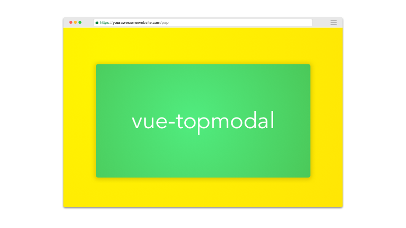

<p align="center">

</p>

<p align="center">
<a href="https://www.npmjs.com/package/vue-topmodal"> </a> <a href="https://vuejs.org/"></a>
</p>

<p align="center">
Stop using broken modals.
</p>

# Features
* Stackable Modals
* Responsive
* Open and close animations (separate animations for background and modal window)
* Scrollable & lock scroll on body
* Customisable modal: borders, shadow, position, colors
* Auto-close on background click
* Background colors and gradients
* Header / Footer / Content Slots

# Getting started

1. Install the plugin:

```
npm install --save vue-topmodal
```
or 
```
yarn add vue-topmodal
```

2. Add the plugin into your app:

```javascript
import Vue from 'vue'
import TopModal from 'vue-topmodal'

Vue.use(TopModal)
```

